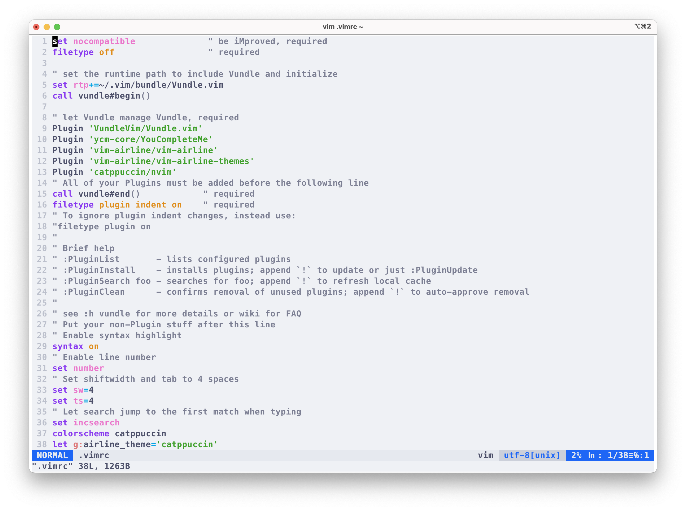

# Vim configure

## Requirements
First, you'd to install Vundle
```bash
git clone https://github.com/VundleVim/Vundle.vim.git ~/.vim/bundle/Vundle.vim
```
Then clone this repository, and put the `.vimrc` to your home directory
```bash
git clone https://github.com/zlicdt/vim-configure && cd vim-configure && mv .vimrc ~/.vimrc && cd .. && rm -rf vim-configure
```
## Install
Launch vim with that args to install files
```bash
vim "+PluginInstall"
```
To build YouCompleteMe, follow that [instruction](https://blog.zlicdt.top/2025/06/05/vim-configure/#TL-DR)
```bash
# For example, a YouCompleteMe with C/C++ Rust JS/TS support
./install.py --clangd-completer --rust-completer --ts-completer
```

